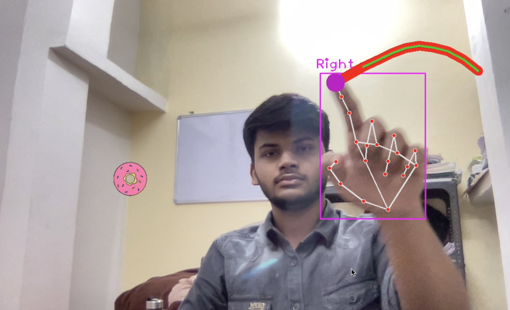

# Snake Game in OpenCV #
## Game preview

### Steps to install this game locally
Make sure you have Python installed on your system.
clone the repository into your local system.

    git clone https://github.com/kumarpriyanshu2k2/OpenCV_snake.git

go to the directory in which you have cloned this project.

    cd ./OpenCV_snake
activate the virtual environment by running:

    source myvenv/bin/activate
then install the required libraries using the following command:

    pip install -r requirements.txt
now you have installed all the required files, you can execute main.py

    python3 main.py

To exit the game you will have to kill it from the terminal by pressing
- ctrl + c

To restart the game from the window itself press.
- R on the keyboard
